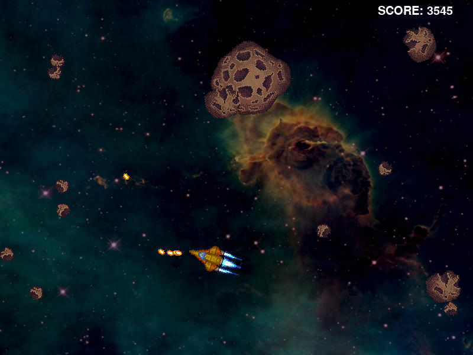

# Asteroids!
Earn points by shooting all the Asteroids, But don't get hit. Points start out at 100 * level, but are reduced with each shot.

# Build
To build the Asteroids binary you will need all build tools needed to compile via Makefile and gcc. You will also need SDL2, SDL2_image, SDL2_mixer and SDL2_ttf both the libraries and headerfiles.

## ArchLinux instructions.

    sudo pacman -S --needed base-devel
    sudo pacman -S --needed sdl2 sdl2_image sdl2_mixer sdl2_ttf
    make release run

# Controls
Up Arrow - Fires the main engines.\
Right Arrow - Rotates Clockwise.\
Left Arrow - Rotates Anticlockwise.\
Space Bar - Fires the main gun.\
Escape - Quits and closes game.\
F - Enables showFPS.
